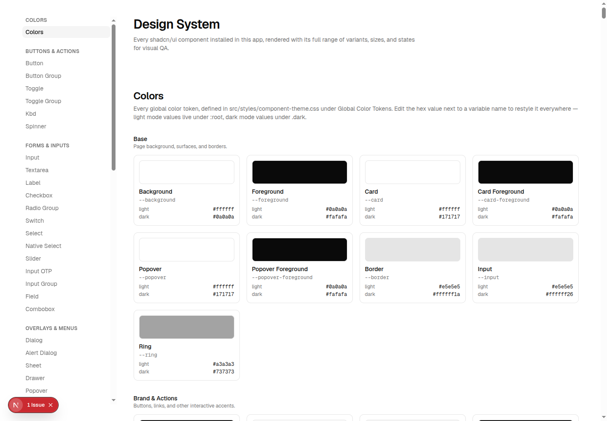
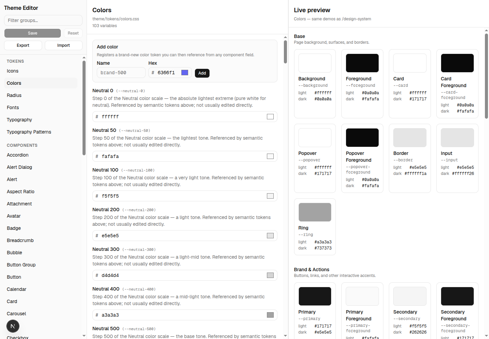

# staunch-shadcn-design-system-kit

A CLI that scaffolds a full [shadcn/ui](https://ui.shadcn.com)-based component set, a token-driven
theme system, a `/design-system` showcase page, and a live `/theme-editor` into a **Next.js (App
Router)** or **Vite + React** project — TypeScript required.

It works like `shadcn init`/`add`: it **copies real source files into your repo** (you own and can
edit every line) rather than shipping a compiled component library from `node_modules`. This is
required for the theme editor's "Save" button, which rewrites your own CSS/TS files on disk.

|                     `/design-system`                     |                    `/theme-editor`                    |
| :--------------------------------------------------------: | :------------------------------------------------------: |
|  |  |

## What you get

- **95 shadcn/ui-based components** (`src/components/ui/*.tsx`) — Radix-based, already wired to the theme
  system (every component reads its colors/spacing/typography from CSS custom properties, not
  hardcoded Tailwind values). The catalog includes advanced building blocks such as sortable
  lists, rich-text editing, address autocomplete, uploads/image cropping, payment methods,
  Stripe Elements, OAuth sign-in, notifications, and PDF documents.
- **A token-driven theme system** (`src/styles/theme/`) — global tokens (colors, radius, fonts,
  typography, shadows, and semantic Success/Warning/Info families) plus one CSS file per
  component, all editable by hand or from the theme editor. Manrope is the default sans/heading
  family and Geist Mono is used for code.
- **`/design-system`** — every installed component rendered in every variant/size/state, for visual
  QA.
- **`/theme-editor`** — a live editor: human-readable labels + descriptions per CSS variable, hex/
  unit-aware inputs with validation, a live preview pane, and Export/Import of your whole theme as
  JSON. Its Save button writes straight back to your theme CSS files (dev-only).
- **Pick only the components you want.** `init` prompts you with a searchable component picker
  (type to filter by name or category, Space to toggle); only the npm packages, `.tsx` files, and
  CSS those components need are installed. Re-run `init` any time to add more — it never deletes
  or overwrites your own edits.

## Requirements

- A TypeScript project.
- **Next.js 16+ (App Router)**, or **Vite + React** (the standard `create-vite --template react-ts`
  layout).
- Tailwind v4 is **not** a prerequisite — `init` installs it and wires it up if it isn't already
  there (`postcss.config.mjs` + the full `@theme` block for Next, the `@tailwindcss/vite` plugin
  for Vite). Scaffold with `create-next-app --no-tailwind` and it still works.
- **`src/` directory is optional for Next.js** — `init` detects whether your project uses `src/app`
  or a root-level `app/` (Next's current "recommended defaults" no longer use `src/`) and installs
  everything at the matching depth (`app/`, `components/`, `styles/`, … or `src/app/`, `src/components/`,
  `src/styles/`, …), including the right `@/*` alias (`./*` vs `./src/*`). Vite projects always use
  `src/` (that's the standard `create-vite` layout, so there's nothing to detect there).

## Usage

```bash
# From inside your Next.js or Vite project:
npx staunch-shadcn-design-system-kit init
```

You'll be asked which components to install (grouped the same way the shadcn docs group them —
Buttons & Actions, Forms & Inputs, Overlays & Menus, …). Dependency installation and a few
confirmations follow; pass `-y`/`--yes` to skip prompts (implies "install everything" unless you
also pass `--components`).

### Flags

| Flag                     | Effect                                                                 |
| ------------------------ | ----------------------------------------------------------------------- |
| `-y`, `--yes`             | Skip confirmation prompts. Implies `--all` unless `--components` is set. |
| `--all`                   | Install every component, skipping the picker.                          |
| `--components <slugs>`    | Comma-separated slugs (e.g. `button,dialog,input`), skipping the picker. |
| `--pm <npm\|pnpm\|yarn\|bun>` | Force a package manager instead of auto-detecting from the lockfile. |
| `--skip-install`          | Skip `npm install` (useful in CI or if you'll install yourself).       |
| `--cwd <path>`            | Run against a project directory other than the current one.            |
| `--dry-run`               | Print exactly what would be installed/copied/changed and stop — writes nothing. `remove` and `update` support it too. |
| `--report`                | Print a source file-size and npm dependency breakdown for the selection (combine with `--dry-run` for a fully non-destructive preview). |
| `--templates <path>`      | Use templates from a local kit checkout instead of the CDN (maintainer/development use). |

`--all` is intended for evaluation, demos, and smoke testing. Production projects should prefer
`--components` (or the interactive picker) so unused components and their dependencies do not
inflate the application bundle; a full Vite install can legitimately trigger a large-chunk warning.

### Adding more components later

Just run `init` again. Your previous picks are remembered (in `design-kit.json`, written to your
project root) and pre-checked in the picker, so you only need to check the *new* ones. Nothing
that already exists on disk is ever overwritten — files you've hand-edited are always left alone.

```bash
npx staunch-shadcn-design-system-kit init --components calendar,chart
```

### Auth pages (opt-in)

Install the `auth` slug to get Login, Signup, Forgot Password, Verify OTP, Reset Password,
Accept Invitation, Change Password, and a post-login home stub — as product routes under
`/auth/*` (not design-system demos). Includes GraphQL mutation documents and an in-memory mock
(`demo@example.com` / `Password1!`, OTP always `123456`). Point `createAuthFetch({ endpoint })`
at your API (or replace documents in `auth-operations.ts`) when you go live.

```bash
npx staunch-shadcn-design-system-kit init --components auth
```

Next.js App Router routes work immediately. Vite: mount the pages from `src/auth/*Page.tsx` with
your router (the CLI prints example `<Route>` lines). `auth` is not in the interactive picker’s
nav groups — pass `--components auth` (or `--all`) to install it.

Point auth at the Nest demo API by setting `NEXT_PUBLIC_GRAPHQL_URL=http://localhost:4000/graphql`
(see sibling repo `design-kit-api`).

### Chat inbox (opt-in)

Install the `chat` slug for a full realtime inbox: conversation list (Chats / Archived), search,
new chat, mark-as-read, archive, text + image attachments, and GraphQL subscriptions. Product
route: `/chat` and `/chat/[id]` for active chats, `/chat/archived` and `/chat/archived/[id]` for archived (requires an auth session). Defaults to an in-memory mock; wire a real API via:

```bash
npx staunch-shadcn-design-system-kit init --components chat,auth
```

```env
NEXT_PUBLIC_GRAPHQL_URL=http://localhost:4000/graphql
NEXT_PUBLIC_GRAPHQL_WS_URL=ws://localhost:4000/graphql
```

Vite uses `VITE_GRAPHQL_URL`, `VITE_GRAPHQL_WS_URL`. Image attachments travel inline with
`sendMessage` as a GraphQL multipart upload — no separate upload URL needed. Run
`design-kit-api` (Postgres + Nest) for the full stack.

### CRUD system (opt-in)

Install `crud-table` for a complete typed CRUD screen: data table, sorting/filtering, debounced
search, pagination, create/edit forms, delete confirmation, GraphQL client helpers, and a local
mock-backed showcase. The generated pieces are composable, so projects can keep the UI and replace
the transport layer with their own API.

```bash
npx staunch-shadcn-design-system-kit init --components crud-table
```

### Removing components later

```bash
npx staunch-shadcn-design-system-kit remove calendar,chart
```

Deletes that component's `ui/*.tsx`, theme CSS, and design-system demo file — but only if nothing
else you've kept still needs it (e.g. `remove button` while `combobox` is still installed just
prints "kept — still required by: combobox" and leaves it alone). Prints the exact file list and
asks for confirmation before deleting anything (skip with `-y`/`--yes`), since these are your
project's own copies and may have been hand-edited. Regenerates `nav.ts`, the design-system page,
the theme editor's live preview, and `theme.manifest.json` afterward.

Two things it deliberately does **not** do, since both are riskier to automate than to leave as a
one-line manual step:

- **Unwire `<TooltipProvider>`/`<Toaster />` from your layout/app root.** Removing `tooltip` or
  `sonner` deletes the component file but leaves the import/JSX in place — you'll get a "module not
  found" until you remove that wrapper by hand (the CLI tells you exactly which one).
- **Uninstall now-unused npm packages.** It prints which ones look safe to remove, but doesn't run
  `npm uninstall` itself, since a package it thinks came in for one component might be used
  elsewhere in your own code.

### Pulling in template fixes/improvements later

```bash
npx staunch-shadcn-design-system-kit update
```

`init` copies real source files into your repo, so a bug fix or improvement made to this package
after you ran `init` doesn't reach your project on its own. `update` re-syncs every currently
installed file to whatever the CLI version you're running now ships — but only the ones you
haven't touched: it records a content hash for each file at install time, and on `update` only
overwrites a file if its current content still matches that hash exactly. Anything that doesn't
match — because you edited it — is left alone and listed as "customized, skipped" (pass `--force`
to overwrite those too). It never deletes anything (that's `remove`'s job) and always fully
regenerates `nav.ts`/the design-system page/the theme editor live preview/`theme.manifest.json`,
since those are meant to be entirely CLI-owned.

## Next.js vs Vite

The 95 UI components, the theme system, and the theme editor's own chrome are 100% shared code —
none of it imports anything Next- or Vite-specific. Only three things differ:

|                          | Next.js                                      | Vite                                                             |
| ------------------------ | --------------------------------------------- | ----------------------------------------------------------------- |
| Design system route      | `src/app/design-system/page.tsx` (App Router) | `src/design-system/DesignSystemPage.tsx` — mount it in your own router |
| Theme editor route       | `src/app/theme-editor/page.tsx`               | `src/theme-editor/ThemeEditorPage.tsx` — same                     |
| Theme "Save" persistence | `src/app/api/theme/save/route.ts`             | `vite-plugin-design-kit.ts`, registered in `vite.config.ts` (dev-server middleware) |
| CSS entry                | `src/app/globals.css`                         | `src/index.css`, using Tailwind v4's `@tailwindcss/vite` plugin instead of PostCSS |
| Default font             | Manrope + Geist Mono via `next/font/google`   | The same families, self-hosted via `@fontsource/manrope`/`@fontsource/geist-mono` |

Vite has no built-in router, so after `init` you'll need to mount `DesignSystemPage`/
`ThemeEditorPage` yourself (the CLI prints an example using `react-router-dom`) and wrap your app
root in `<TooltipProvider>`/`<Toaster />` if you installed Tooltip/Sonner.

Vite also has no `next/font` equivalent, so `init` always installs `@fontsource/manrope` and
`@fontsource/geist-mono` (regardless of which components you pick — same as Next always getting
both through `layout.tsx`) and imports them in `src/index.css`, so `--font-sans`/`--font-mono`
resolve to the same families Next uses, self-hosted with no external Google Fonts request. Swap in
a different `@fontsource/*` package and update those two `@import`/`--font-*` lines in
`src/index.css` if you want a different default font.

## Component selection details

- Picking a component automatically pulls in whatever it depends on (e.g. **Combobox** needs
  **Popover** + **Input Group**; **Sidebar** needs **Button**, **Sheet**, **Tooltip**, etc.).
- The design-system demo files bundle several components together per category (the same way the
  shadcn docs group them). Picking *any* component from a category installs that whole category's
  demo and its full cast — you can't get a partial "Forms & Inputs" demo page, since the demo file
  itself imports every component in that category. The CLI reports which extra components got
  pulled in this way so it's never a surprise.
- The theme editor's own UI (its Save/Reset buttons, filter input, Add-color/font/typography forms)
  always needs a small fixed set of components (`button`, `input`, `label`, `separator`, `field`,
  `input-group`, `native-select`, `textarea`) regardless of what you pick — these are installed
  automatically but **never** cause their demo category to appear in `/design-system` unless you
  actually chose one of them yourself.
- `theme.manifest.json` (what drives the theme editor's sidebar) is regenerated from whatever CSS
  files are actually on disk, so it's always in sync with your current selection.

## Renaming design tokens

`/theme-editor` lets you rename a token's **identifier** — not just its value — for color
families/semantic slots, radius steps, typography variants, and shadow steps. A rename
propagates everywhere the old name was used: every CSS declaration and `var()` reference,
the Tailwind `@theme` bridge (so `bg-accent` becomes `bg-info`, not just the color it
resolves to), literal Tailwind classNames in every vendored component and demo section,
and hand-authored description prose.

Open the group you want to rename something in (Colors, Color Scales, Radius, Typography,
or Shadows) — each has a **Rename token** panel above its fields:

1. Pick the token (**From**) and type its new name (**To**). A name that collides with a
   Tailwind builtin (`transparent`, `full`, `none`, …) is rejected inline, with an info
   icon listing what's reserved for that family.
2. **Preview** — lists every file that will change and how many occurrences, before
   anything is written.
3. **Confirm rename** — writes it for real and reloads the editor with the new name in
   place.

This is a real, repo-wide rewrite (potentially 50+ files for a widely-used color family) —
dev-only, same as Save.

**Adding components after a rename:** rename `accent` → `info`, then later run
`init`/`update` to add a component that wasn't installed yet — it's corrected on the way
in, arriving already saying `info` instead of the original template's `accent`. This is
tracked in a small `src/lib/theme/token-renames.json` the CLI reads automatically; you
don't need to do anything for it to work.

**Deleting a custom token:** a color/typography/font you added via the "Add" forms in
`/theme-editor` gets a remove (×) button in the same panel. Colors and typography can only
be removed before you Save (once saved, they become an ordinary token like any built-in
one); a custom font can be removed even after it's been saved.

## TypeScript 5 / 6 / 7 compatibility

Every `init` run checks your tsconfig against TypeScript 7's breaking changes (removed
`moduleResolution`/`module`/`target` values, removed `baseUrl`, the `types` default changing from
`["*"]` to `[]`) regardless of which TypeScript version you're actually on:

- **Already on TypeScript 7**: anything that would hard-error gets flagged; if your tsconfig has no
  explicit `"types"` array, one is generated for you from your installed `@types/*` packages (the
  one case that's safe to auto-fix — everything else needs your judgment, since e.g. rewriting
  `baseUrl` + `paths` requires knowing your actual path-alias intent).
- **On TypeScript 5 or 6**: the same checks run, but nothing is broken today — you'll see them as
  forward-looking notes ("fine now, will need attention when you eventually upgrade"), and the CLI
  doesn't touch your tsconfig.

## What `init` never does

- Delete or overwrite a file you already have (component edits, custom sections, etc. are safe).
- Write to `src/app/globals.css`/`src/index.css` destructively — if it doesn't recognize the file as
  either a stock scaffold or already-wired-up, it prints the snippet to merge by hand instead of
  guessing.
- Touch anything in production (the theme editor's Save endpoint / Vite plugin both refuse to run
  outside development).

## Development (working on this CLI itself)

```bash
npm install
npm run build            # tsup → dist/cli.js
npm run build:registry   # regenerate src/generated/registry.ts if you change the templates
npm run lint             # ESLint — CLI source and maintainer scripts
npm test                 # vitest — CLI utilities plus focused component interaction tests
npm run smoke            # scaffold/build/lint scenarios plus a Playwright runtime pass
```

`npm run smoke` is the slow-but-real check: it builds the CLI, scaffolds a fresh `create-next-app`
and `create-vite` project for both a full (`--all`) and a partial component selection, runs
`design-kit init` against each, then runs that project's own `build`/`lint`. A fifth scenario
starts Next.js and checks `/design-system`, `/theme-editor`, typography tokens, and a Rating
interaction in Chromium. Takes a few minutes
(network + framework builds) — run it before anything that touches the templates, the splitter,
the registry, or the config patchers. `--keep` leaves the scaffolded projects on disk for
inspection instead of deleting them; `--only next`/`--only vite` runs just one framework's
scenarios.

`template-shared/`, `template-next/`, and `template-vite/` are real, working source files — edit
them directly (they're literally what gets copied into a consumer's project), then re-run
`npm run build:registry` if you added/removed/renamed a component so the picker and dependency
resolution stay accurate.

### Component API convention

New controlled components should expose `value` and `onValueChange`. Avoid introducing
`onChange` or `onSelectedChange` for the same value-only callback shape; reserve `onChange` for
native-event-compatible APIs. Existing public props are kept for compatibility and can be migrated
only through an explicitly documented breaking release.

Until the first npm release is available, run the built `dist/cli.js` directly against a target
project with `--cwd`, or `cd` into the project first. Releases are managed by Changesets and the
release workflow.

### Versioning

Follows [Semantic Versioning](https://semver.org/), managed with
[Changesets](https://github.com/changesets/changesets) — see `CHANGELOG.md` for what "breaking"
means for a tool that copies files instead of shipping a versioned library. Day to day:

```bash
npm run changeset   # record what you changed and its bump type (patch/minor/major)
npm run version     # on release: consumes pending changesets, bumps the version, writes the changelog
```

`npm run changeset` compares the current branch with `main`; run it from a feature branch that
contains the user-facing change you want to describe.

### Test against a fresh Next.js app

```bash
npx create-next-app@latest my-next-test \
  --typescript --src-dir --app --tailwind --eslint --use-npm --import-alias "@/*"

cd my-next-test
node /path/to/staunch-shadcn-design-system-kit/dist/cli.js init
# or non-interactively:
# node /path/to/staunch-shadcn-design-system-kit/dist/cli.js init --yes --components button,dialog,input

npm run dev
# visit http://localhost:3000/design-system and /theme-editor
```

Tailwind isn't actually required beforehand — `create-next-app --no-tailwind` works too; `init`
installs and wires it up.

To confirm it's not just "the CLI ran without errors" but the app actually works:

```bash
npm run build   # next build — catches anything the picker/codegen/patchers got wrong
```

### Test against a fresh Vite app

```bash
npm create vite@latest my-vite-test -- --template react-ts
cd my-vite-test
npm install
node /path/to/staunch-shadcn-design-system-kit/dist/cli.js init
```

Vite has no built-in router, so wire up the pages it printed instructions for — minimally, edit
`src/App.tsx`:

```tsx
import { TooltipProvider } from '@/components/ui/tooltip'
import { Toaster } from '@/components/ui/sonner'
import DesignSystemPage from '@/design-system/DesignSystemPage'

function App() {
  return (
    <TooltipProvider>
      <DesignSystemPage />
      <Toaster />
    </TooltipProvider>
  )
}
export default App
```

Then:

```bash
npm run dev     # visit http://localhost:5173
npm run build   # vite build — a build that "succeeds" isn't enough; also grep the compiled CSS
                # (dist/assets/*.css) for a class like .bg-primary to confirm Tailwind actually
                # picked up the theme tokens, not just that nothing errored
```

### Test "add more components later"

Re-run `init` against the same project with different `--components` — your previous picks are
remembered (`design-kit.json`) and unioned with the new ones, never replaced:

```bash
node /path/to/staunch-shadcn-design-system-kit/dist/cli.js init --yes --components calendar,chart
```

### Useful flags while iterating

| Flag | Use |
| --- | --- |
| `--skip-install` | Skip `npm install` — much faster once dependencies are already there. |
| `--cwd <path>` | Point at a test project without `cd`-ing into it. |
| `--yes --all` | Full install, no prompts — good smoke-test baseline. |
| `--yes --components a,b,c` | Specific subset, no prompts — good for testing selective install/codegen. |
