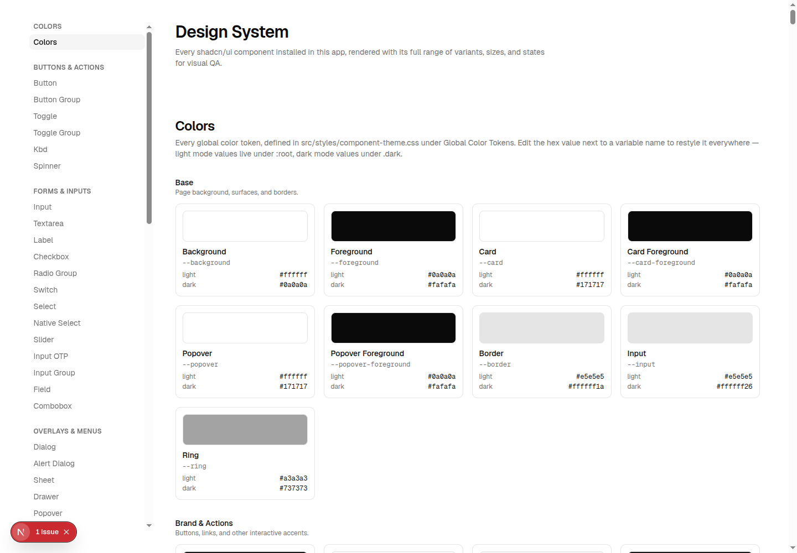

# staunch-shadcn-design-system-kit

A CLI that scaffolds a full [shadcn/ui](https://ui.shadcn.com)-based component set and a
token-driven theme system into a **Next.js (App Router)** or **Vite + React** project — TypeScript
required.

It works like `shadcn init`/`add`: it **copies real source files into your repo** (you own and can
edit every line) rather than shipping a compiled component library from `node_modules`.



## What you get

- **95 shadcn/ui-based components** (`src/components/ui/*.tsx`) — Radix-based, already wired to the theme
  system (every component reads its colors/spacing/typography from CSS custom properties, not
  hardcoded Tailwind values). The catalog includes advanced building blocks such as sortable
  lists, rich-text editing, address autocomplete, uploads/image cropping, payment methods,
  Stripe Elements, OAuth sign-in, notifications, and PDF documents.
- **A token-driven theme system** (`src/styles/theme/`) — global tokens (colors, radius, fonts,
  typography, shadows, and semantic Success/Warning/Info families) plus one CSS file per
  component, editable by hand. Manrope is the default sans/heading family and Geist Mono is used
  for code.
- **`/design-system`** — every installed component rendered in every variant/size/state, for visual
  QA.
- **Pick only the components you want.** `init` prompts you with a searchable component picker
  (type to filter by name or category, Space to toggle); only the npm packages, `.tsx` files, and
  CSS those components need are installed. Re-run `init` any time to add more — it never deletes
  or overwrites your own edits.

## Requirements

- A TypeScript project.
- **Next.js 16+ (App Router)**, or **Vite + React** (the standard `create-vite --template react-ts`
  layout).
- Tailwind v4 is **not** a prerequisite — `init` installs it and wires it up if it isn't already
  there (`postcss.config.mjs` + the full `@theme` block for Next, the `@tailwindcss/vite` plugin
  for Vite). Scaffold with `create-next-app --no-tailwind` and it still works.
- **`src/` directory is optional for Next.js** — `init` detects whether your project uses `src/app`
  or a root-level `app/` (Next's current "recommended defaults" no longer use `src/`) and installs
  everything at the matching depth (`app/`, `components/`, `styles/`, … or `src/app/`, `src/components/`,
  `src/styles/`, …), including the right `@/*` alias (`./*` vs `./src/*`). Vite projects always use
  `src/` (that's the standard `create-vite` layout, so there's nothing to detect there).

## Usage

```bash
# From inside your Next.js or Vite project:
npx staunch-shadcn-design-system-kit init
```

You'll be asked which components to install (grouped the same way the shadcn docs group them —
Buttons & Actions, Forms & Inputs, Overlays & Menus, …). Dependency installation and a few
confirmations follow; pass `-y`/`--yes` to skip prompts (implies "install everything" unless you
also pass `--components`).

### Flags

| Flag                     | Effect                                                                 |
| ------------------------ | ----------------------------------------------------------------------- |
| `-y`, `--yes`             | Skip confirmation prompts. Implies `--all` unless `--components` is set. |
| `--all`                   | Install every component, skipping the picker.                          |
| `--components <slugs>`    | Comma-separated slugs (e.g. `button,dialog,input`), skipping the picker. |
| `--pm <npm\|pnpm\|yarn\|bun>` | Force a package manager instead of auto-detecting from the lockfile. |
| `--skip-install`          | Skip `npm install` (useful in CI or if you'll install yourself).       |
| `--cwd <path>`            | Run against a project directory other than the current one.            |
| `--dry-run`               | Print exactly what would be installed/copied/changed and stop — writes nothing. `remove` and `update` support it too. |
| `--report`                | Print a source file-size and npm dependency breakdown for the selection (combine with `--dry-run` for a fully non-destructive preview). |
| `--templates <path>`      | Use templates from a local kit checkout instead of the CDN (maintainer/development use). |

`--all` is intended for evaluation, demos, and smoke testing. Production projects should prefer
`--components` (or the interactive picker) so unused components and their dependencies do not
inflate the application bundle; a full Vite install can legitimately trigger a large-chunk warning.

### Adding more components later

Just run `init` again. Your previous picks are remembered (in `design-kit.json`, written to your
project root) and pre-checked in the picker, so you only need to check the *new* ones. Nothing
that already exists on disk is ever overwritten — files you've hand-edited are always left alone.

```bash
npx staunch-shadcn-design-system-kit init --components calendar,chart
```

### Auth pages (opt-in)

Install the `auth` slug to get Login, Signup, Forgot Password, Reset Password, Accept
Invitation, Change Password, and a post-login home stub — as product routes under `/auth/*`
(not design-system demos). Includes GraphQL mutation documents and an in-memory mock. Point
`createAuthFetch({ endpoint })` at your API (or replace documents in `auth-operations.ts`) when
you go live.

```bash
npx staunch-shadcn-design-system-kit init --components auth
```

Next.js App Router routes work immediately. Vite: mount the pages from `src/auth/*Page.tsx` with
your router (the CLI prints example `<Route>` lines). `auth` is not in the interactive picker’s
nav groups — pass `--components auth` (or `--all`) to install it.

Point auth at a running Rails GraphQL API by setting
`NEXT_PUBLIC_GRAPHQL_URL=http://localhost:3000/graphql`. Every sign-up and login is a mandatory
two-step flow — there is no direct-token path and no per-user toggle. `signUp`/`login` never
return a token; they create the account or check the password, then always email a 6-digit code
and respond with `{ message, otpSent }`. The login/signup pages show an inline code-entry step
(with a resend action) and complete the flow with `verifyOtp(email, otp)`, which returns
`{ token, user }` — it checks whichever purpose (signup or login) is actually pending, so the
page never has to track which flow sent the code. Forgot-password is a separate, non-OTP flow:
it emails a reset *link* (`resetPasswordToken` arrives as a URL query param), and accepting an
invitation only creates the account (`{ success }`, no token) — the new user still has to sign
in (and complete the OTP step) afterward. There's no `firstName`/`lastName` field anywhere; the
account record is just `id`/`email`/`createdAt`. Every mutation argument is wrapped in a single
`input` GraphQL variable (`login(input: $input)`, not flat arguments) — the backend's mutations
all extend `GraphQL::Schema::RelayClassicMutation`, which always exposes arguments this way.

### Account settings (opt-in)

Install the `account-settings` slug for a change-email wizard (`/auth/email-change`): request a
change with your current password, verify a code sent to your *current* email, then verify a
second code sent to the *new* email before it takes effect — cancelable at either verification
step. Requires the `auth` slug (installed automatically alongside it).

```bash
npx staunch-shadcn-design-system-kit init --components account-settings,auth
```

### Chat inbox (opt-in)

Install the `chat` slug for a full realtime inbox: conversation list (Chats / Archived), search,
new chat, mark-as-read, archive, text + image/video attachments, and GraphQL subscriptions.
Product route: `/chat` and `/chat/[id]` for active chats, `/chat/archived` and
`/chat/archived/[id]` for archived (requires an auth session). Defaults to an in-memory mock;
wire a real API via:

```bash
npx staunch-shadcn-design-system-kit init --components chat,auth
```

```env
NEXT_PUBLIC_GRAPHQL_URL=http://localhost:3000/graphql
NEXT_PUBLIC_GRAPHQL_WS_URL=ws://localhost:3000/cable
```

Vite uses `VITE_GRAPHQL_URL`, `VITE_GRAPHQL_WS_URL`. Image/video attachments travel inline
with `sendMessage` as a GraphQL multipart upload — no separate upload URL needed.
`messageType` is one of `TEXT`/`IMAGE`/`VIDEO`/`ANNOUNCEMENT`. Subscriptions run over Rails
ActionCable (not the `graphql-ws` protocol) — `NEXT_PUBLIC_GRAPHQL_WS_URL`/`VITE_GRAPHQL_WS_URL`
must point at the backend's ActionCable mount (`/cable` by default), and the connection
identifies the user via a **signed `?token=` query param** — the same JWT sent as
`Authorization: Bearer` on GraphQL HTTP requests, not a bare `userId` (ActionCable's handshake
has no header injection point, so the token travels in the URL instead). Match that on the
backend or subscriptions will silently fail to authorize. The socket itself is shared and reused
across every feature that subscribes (chat, `notification-center` if also installed) — opening
one feature's subscriptions doesn't open a second physical connection for the other.

### User management (opt-in)

Install `user-management` for an admin screen at `/user-management` (Next: query-param tabs
`?tab=all|active|archived|pending`; Vite: `/user-management/:tab`) listing users and pending
invitations, with edit/archive/restore, send/resend invitation, role-grant management, and
impersonation.

```bash
npx staunch-shadcn-design-system-kit init --components user-management,auth
```

Like `auth`, it's not in the interactive picker's nav groups — pass `--components` (or `--all`)
to install it. Bundles its own private copies of `auth`'s session/fetch helpers, so it works even
if `auth` isn't separately selected, but you'll want `auth` too for actual sign-in.

**Every action is gated server-side, never re-derived here.** The page itself checks a single
global ability (`can('users:view')`) before rendering at all — if your backend doesn't grant it,
the page shows "You don't have access to this page" instead of an empty or broken table. Each row
then carries its own `abilities` array (e.g. `edit`, `archive`, `restore`, `impersonate`) computed
per-row by the backend, and the UI only shows the buttons a given row's abilities list actually
includes — a `member` viewing another user's row simply has no Impersonate button to click, rather
than a client-side role check hiding it. `ImpersonateUser`/`StopImpersonating` swap the session's
JWT via `setAuthSession` and route to `/chat`.

Queries: `users(tab, search, page, perPage)`, `invitations(page, perPage)`,
`usersAndInvitations(search, page, perPage)` (a union of `User`/`Invitation`), `grants(userId)`.
Mutations (each wraps its arguments in a single `$input`, per this backend's
`RelayClassicMutation` convention): `updateUser`, `archiveUser`, `restoreUser`,
`updateUserRoles`, `sendInvitation`, `resendInvitation`, `createGrant`, `revokeGrant`,
`impersonateUser`, `stopImpersonating`.

### Feature flags admin (opt-in)

Install `feature-flags-admin` for a role × feature matrix at `/feature-flags-admin` — a checkbox
grid where each cell toggles whether a role can use a given backend feature flag.

```bash
npx staunch-shadcn-design-system-kit init --components feature-flags-admin,auth
```

Not in the interactive picker's nav groups — pass `--components` (or `--all`); like
`user-management`, it bundles its own private `auth` helper copies, so `auth` isn't a hard
prerequisite, just needed for actual sign-in. Gated by `can('feature_flags:manage')`. An
untouched cell defaults to **off** (fail-closed) once any cell for that feature has been touched
at all. Some cells render as a disabled dash instead of a checkbox: a role whose own backend
policy hard-denies a feature regardless of the flag (the
matrix's `eligible` field per cell) can't be "granted" it here — the checkbox would silently do
nothing, so it isn't offered.

Query: `featureFlags` → `{ features, roles, cells: [{ feature, role, enabled, eligible }] }`.
Mutation: `updateFeatureFlag(feature, role, enabled)`.

### Delivery logs (opt-in)

Install `delivery-logs` for a read-only email/SMS delivery history at `/delivery-logs`, with
All/Email/SMS tabs and status badges (sent/delivered, pending/scheduled, failed/undelivered).

```bash
npx staunch-shadcn-design-system-kit init --components delivery-logs,auth
```

Not in the interactive picker's nav groups — pass `--components` (or `--all`); bundles its own
private `auth` helper copies the same way. Gated by `can('delivery_logs:view')`. Read-only by
design — the one real write path (a delivery provider's status webhook) is server-to-server and
has no client-facing mutation.

Query: `deliveryLogs(channel, page, perPage)` → a union of `EmailLog`/`TextMessage` entries.

### Audit trail viewer (opt-in)

Install `audit-trail-viewer` for a change-history screen at `/audit-trail-viewer` — every
create/update/destroy event across your backend's audited models, with a details dialog showing
a human-readable summary and the actual field-level diff.

```bash
npx staunch-shadcn-design-system-kit init --components audit-trail-viewer,auth
```

Not in the interactive picker's nav groups — pass `--components` (or `--all`); bundles its own
private `auth` helper copies the same way. Gated by `can('audit_trail:view')`. Read-only — audit
trail has no mutations of its own; rows are written as a side effect of whatever your other
backend models already do.

Query: `auditTrail(itemType, itemId, page, perPage)` → `{ id, itemType, itemId, event,
whodunnit, createdAt, auditSummary, meaningfulChanges }`.

### Notification center (opt-in)

Install `notification-center` for a real-time notification bell — unlike the sections above,
it's a **widget, not a page**: there's no route or nav entry, and no ability gate. It shows up in
the interactive picker (under Overlays & Menus) since there's nothing else to opt into first.

```bash
npx staunch-shadcn-design-system-kit init --components notification-center
```

You mount it yourself, wherever your layout wants a bell icon:

```tsx
import { NotificationCenter } from '@/components/notification-center/notification-center'
import { useNotifications } from '@/components/notification-center/use-notifications'

const { items, unreadCount, markAsRead, markAllAsRead } = useNotifications({
  graphqlUrl: process.env.NEXT_PUBLIC_GRAPHQL_URL, // Vite: import.meta.env.VITE_GRAPHQL_URL
  graphqlWsUrl: process.env.NEXT_PUBLIC_GRAPHQL_WS_URL,
})

<NotificationCenter items={items} unreadCount={unreadCount} onItemClick={markAsRead} onMarkAllRead={markAllAsRead} />
```

Live updates use the exact same ActionCable transport as `chat` (same `?token=` JWT query param,
same shared socket via `cable-connection.ts` — installing both never opens two connections).
Query: `notifications(read, page, perPage)` → `{ unreadCount, notifications: [...] }`. Mutations:
`markNotificationAsRead(notificationId)`, `markAllNotificationsAsRead`. Subscription:
`notificationUpdated(userId)` → `{ event, unreadCount, notification }`, where `event` is one of
`"created" | "updated" | "deleted" | "all_read"`.

The backend stores no title/body copy for a notification — only a `notificationType` string and
a `metadata` object — so the default render is just the humanized type (`"message_received"` →
"Message Received"). Pass a `describe` function to `useNotifications()` to render real copy from
`metadata` instead:

```tsx
useNotifications({
  describe: (n) =>
    n.notificationType === 'message_received'
      ? { title: `New message from ${n.metadata.sender_name}`, description: n.metadata.preview }
      : { title: n.notificationType },
})
```

If you've also installed `chat` against the Rails backend this kit targets, `message_received`
is raised automatically by its `sendMessage` mutation for every other participant — no backend
wiring needed for that one notification type.

### Address autocomplete (needs a server-side key)

`AddressAutocomplete` (in the main component picker, under Forms & Inputs) proxies Google Places
through your own `/api/places/autocomplete` and `/api/places/details` routes (Next API routes;
Vite dev-server middleware, `vite-plugin-design-kit.ts`) rather than calling Google directly from
the browser. Set `GOOGLE_PLACES_API_KEY` — **not** `NEXT_PUBLIC_GOOGLE_PLACES_API_KEY` or
`VITE_GOOGLE_PLACES_API_KEY` — in your server environment; there is no client-side `apiKey` prop
to pass. A server-to-server Places call can't be restricted by HTTP referrer the way a
browser-side one can, so keeping the key off the client entirely (rather than exposing it and
still proxying, which gets you the worst of both) is deliberate, not an oversight.

If the key isn't configured, the component still renders normally and only surfaces the problem
once a search is actually attempted (a `REQUEST_DENIED`-shaped error from the proxy), rather than
refusing to render up front.

Unlike Google Places, `stripe-payment-method`/`payment-method-list` (also under Forms & Inputs)
take a `publishableKey` prop you pass in yourself (e.g.
`process.env.NEXT_PUBLIC_STRIPE_PUBLISHABLE_KEY`)
rather than sourcing an env var internally — Stripe's own publishable keys are meant to be
client-visible, so there's no proxy involved and nothing insecure about the `NEXT_PUBLIC_`/`VITE_`
prefix here. `StripeElementsProvider` renders an inline "not configured" message if you forget it.

### CRUD system (opt-in)

Install `crud-table` for a complete typed CRUD screen: data table, sorting/filtering, debounced
search, pagination, create/edit forms, delete confirmation, GraphQL client helpers, and a local
mock-backed showcase. The generated pieces are composable, so projects can keep the UI and replace
the transport layer with their own API.

```bash
npx staunch-shadcn-design-system-kit init --components crud-table
```

### Removing components later

```bash
npx staunch-shadcn-design-system-kit remove calendar,chart
```

Deletes that component's `ui/*.tsx`, theme CSS, and design-system demo file — but only if nothing
else you've kept still needs it (e.g. `remove button` while `combobox` is still installed just
prints "kept — still required by: combobox" and leaves it alone). Prints the exact file list and
asks for confirmation before deleting anything (skip with `-y`/`--yes`), since these are your
project's own copies and may have been hand-edited. Regenerates `nav.ts` and the design-system
page afterward.

Two things it deliberately does **not** do, since both are riskier to automate than to leave as a
one-line manual step:

- **Unwire `<TooltipProvider>`/`<Toaster />` from your layout/app root.** Removing `tooltip` or
  `sonner` deletes the component file but leaves the import/JSX in place — you'll get a "module not
  found" until you remove that wrapper by hand (the CLI tells you exactly which one).
- **Uninstall now-unused npm packages.** It prints which ones look safe to remove, but doesn't run
  `npm uninstall` itself, since a package it thinks came in for one component might be used
  elsewhere in your own code.

### Pulling in template fixes/improvements later

```bash
npx staunch-shadcn-design-system-kit update
```

`init` copies real source files into your repo, so a bug fix or improvement made to this package
after you ran `init` doesn't reach your project on its own. `update` re-syncs every currently
installed file to whatever the CLI version you're running now ships — but only the ones you
haven't touched: it records a content hash for each file at install time, and on `update` only
overwrites a file if its current content still matches that hash exactly. Anything that doesn't
match — because you edited it — is left alone and listed as "customized, skipped" (pass `--force`
to overwrite those too). It never deletes anything (that's `remove`'s job) and always fully
regenerates `nav.ts`/the design-system page, since those are meant to be entirely CLI-owned.

If a newer template needs an npm package your original `init` never installed (e.g. a component
gained a new import), `update` checks for that too — it prints `Will install: <package>` and
installs it the same way `init` does, before touching any files, so the newly-updated code
doesn't fail to build for want of a dependency that was never there.

## Next.js vs Vite

The 95 UI components and the theme system are 100% shared code — none of it imports anything
Next- or Vite-specific. Only two things differ:

|                          | Next.js                                      | Vite                                                             |
| ------------------------ | --------------------------------------------- | ----------------------------------------------------------------- |
| Design system route      | `src/app/design-system/page.tsx` (App Router) | `src/design-system/DesignSystemPage.tsx` — mount it in your own router |
| CSS entry                | `src/app/globals.css`                         | `src/index.css`, using Tailwind v4's `@tailwindcss/vite` plugin instead of PostCSS |
| Default font             | Manrope + Geist Mono via `next/font/google`   | The same families, self-hosted via `@fontsource/manrope`/`@fontsource/geist-mono` |

Vite has no built-in router, so after `init` you'll need to mount `DesignSystemPage` yourself (the
CLI prints an example using `react-router-dom`) and wrap your app root in
`<TooltipProvider>`/`<Toaster />` if you installed Tooltip/Sonner.

Vite also has no `next/font` equivalent, so `init` always installs `@fontsource/manrope` and
`@fontsource/geist-mono` (regardless of which components you pick — same as Next always getting
both through `layout.tsx`) and imports them in `src/index.css`, so `--font-sans`/`--font-mono`
resolve to the same families Next uses, self-hosted with no external Google Fonts request. Swap in
a different `@fontsource/*` package and update those two `@import`/`--font-*` lines in
`src/index.css` if you want a different default font.

## Component selection details

- Picking a component automatically pulls in whatever it depends on (e.g. **Combobox** needs
  **Popover** + **Input Group**; **Sidebar** needs **Button**, **Sheet**, **Tooltip**, etc.).
- The design-system demo files bundle several components together per category (the same way the
  shadcn docs group them). Picking *any* component from a category installs that whole category's
  demo and its full cast — you can't get a partial "Forms & Inputs" demo page, since the demo file
  itself imports every component in that category. The CLI reports which extra components got
  pulled in this way so it's never a surprise.
## TypeScript 5 / 6 / 7 compatibility

Every `init` run checks your tsconfig against TypeScript 7's breaking changes (removed
`moduleResolution`/`module`/`target` values, removed `baseUrl`, the `types` default changing from
`["*"]` to `[]`) regardless of which TypeScript version you're actually on:

- **Already on TypeScript 7**: anything that would hard-error gets flagged; if your tsconfig has no
  explicit `"types"` array, one is generated for you from your installed `@types/*` packages (the
  one case that's safe to auto-fix — everything else needs your judgment, since e.g. rewriting
  `baseUrl` + `paths` requires knowing your actual path-alias intent).
- **On TypeScript 5 or 6**: the same checks run, but nothing is broken today — you'll see them as
  forward-looking notes ("fine now, will need attention when you eventually upgrade"), and the CLI
  doesn't touch your tsconfig.

## What `init` never does

- Delete or overwrite a file you already have (component edits, custom sections, etc. are safe).
- Write to `src/app/globals.css`/`src/index.css` destructively — if it doesn't recognize the file as
  either a stock scaffold or already-wired-up, it prints the snippet to merge by hand instead of
  guessing.

## Development (working on this CLI itself)

```bash
npm install
npm run build            # tsup → dist/cli.js
npm run build:registry   # regenerate src/generated/registry.ts if you change the templates
npm run lint             # ESLint — CLI source and maintainer scripts
npm test                 # vitest — CLI utilities plus focused component interaction tests
npm run smoke            # scaffold/build/lint scenarios plus a Playwright runtime pass
```

`npm run smoke` is the slow-but-real check: it builds the CLI, scaffolds a fresh `create-next-app`
and `create-vite` project for both a full (`--all`) and a partial component selection, runs
`design-kit init` against each, then runs that project's own `build`/`lint`. A fifth scenario
starts Next.js and checks `/design-system`, typography tokens, and a Rating
interaction in Chromium. Takes a few minutes
(network + framework builds) — run it before anything that touches the templates, the splitter,
the registry, or the config patchers. `--keep` leaves the scaffolded projects on disk for
inspection instead of deleting them; `--only next`/`--only vite` runs just one framework's
scenarios.

`template-shared/`, `template-next/`, and `template-vite/` are real, working source files — edit
them directly (they're literally what gets copied into a consumer's project), then re-run
`npm run build:registry` if you added/removed/renamed a component so the picker and dependency
resolution stay accurate.

### Component API convention

New controlled components should expose `value` and `onValueChange`. Avoid introducing
`onChange` or `onSelectedChange` for the same value-only callback shape; reserve `onChange` for
native-event-compatible APIs. Existing public props are kept for compatibility and can be migrated
only through an explicitly documented breaking release.

Until the first npm release is available, run the built `dist/cli.js` directly against a target
project with `--cwd`, or `cd` into the project first. Releases are managed by Changesets and the
release workflow.

### Versioning

Follows [Semantic Versioning](https://semver.org/), managed with
[Changesets](https://github.com/changesets/changesets) — see `CHANGELOG.md` for what "breaking"
means for a tool that copies files instead of shipping a versioned library. Day to day:

```bash
npm run changeset   # record what you changed and its bump type (patch/minor/major)
npm run version     # on release: consumes pending changesets, bumps the version, writes the changelog
```

`npm run changeset` compares the current branch with `main`; run it from a feature branch that
contains the user-facing change you want to describe.

### Test against a fresh Next.js app

```bash
npx create-next-app@latest my-next-test \
  --typescript --src-dir --app --tailwind --eslint --use-npm --import-alias "@/*"

cd my-next-test
node /path/to/staunch-shadcn-design-system-kit/dist/cli.js init
# or non-interactively:
# node /path/to/staunch-shadcn-design-system-kit/dist/cli.js init --yes --components button,dialog,input

npm run dev
# visit http://localhost:3000/design-system
```

Tailwind isn't actually required beforehand — `create-next-app --no-tailwind` works too; `init`
installs and wires it up.

To confirm it's not just "the CLI ran without errors" but the app actually works:

```bash
npm run build   # next build — catches anything the picker/codegen/patchers got wrong
```

### Test against a fresh Vite app

```bash
npm create vite@latest my-vite-test -- --template react-ts
cd my-vite-test
npm install
node /path/to/staunch-shadcn-design-system-kit/dist/cli.js init
```

Vite has no built-in router, so wire up the pages it printed instructions for — minimally, edit
`src/App.tsx`:

```tsx
import { TooltipProvider } from '@/components/ui/tooltip'
import { Toaster } from '@/components/ui/sonner'
import DesignSystemPage from '@/design-system/DesignSystemPage'

function App() {
  return (
    <TooltipProvider>
      <DesignSystemPage />
      <Toaster />
    </TooltipProvider>
  )
}
export default App
```

Then:

```bash
npm run dev     # visit http://localhost:5173
npm run build   # vite build — a build that "succeeds" isn't enough; also grep the compiled CSS
                # (dist/assets/*.css) for a class like .bg-primary to confirm Tailwind actually
                # picked up the theme tokens, not just that nothing errored
```

### Test "add more components later"

Re-run `init` against the same project with different `--components` — your previous picks are
remembered (`design-kit.json`) and unioned with the new ones, never replaced:

```bash
node /path/to/staunch-shadcn-design-system-kit/dist/cli.js init --yes --components calendar,chart
```

### Useful flags while iterating

| Flag | Use |
| --- | --- |
| `--skip-install` | Skip `npm install` — much faster once dependencies are already there. |
| `--cwd <path>` | Point at a test project without `cd`-ing into it. |
| `--yes --all` | Full install, no prompts — good smoke-test baseline. |
| `--yes --components a,b,c` | Specific subset, no prompts — good for testing selective install/codegen. |
